# Medilab ProKit – UI Demo

A comprehensive Flutter UI demo for a medical or healthcare-related app.  
This is a **UI-only** project crafted to display modern, clean, and professional medical app interfaces—no backend or live data included.

---

## 📱 Overview

The demo features a wide range of screens typically found in healthcare platforms, such as:

- Doctor listings and profiles
- Appointment scheduling
- Patient dashboard
- Health records and reports
- Notifications and more

---

## 🔍 Status

**Demo only** – No backend integration or working functionality.

---

## 📸 Screenshots

<table>
  <tr>
    <td>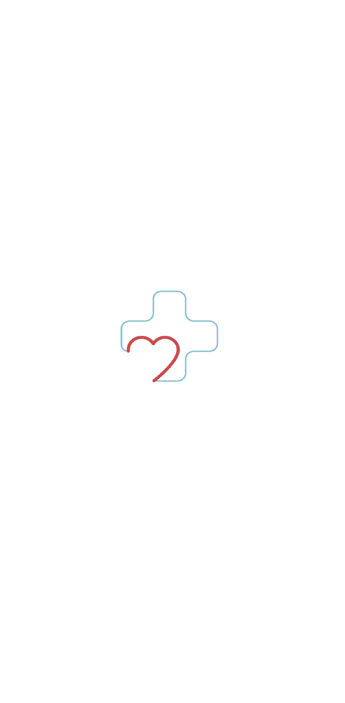</td>
    <td>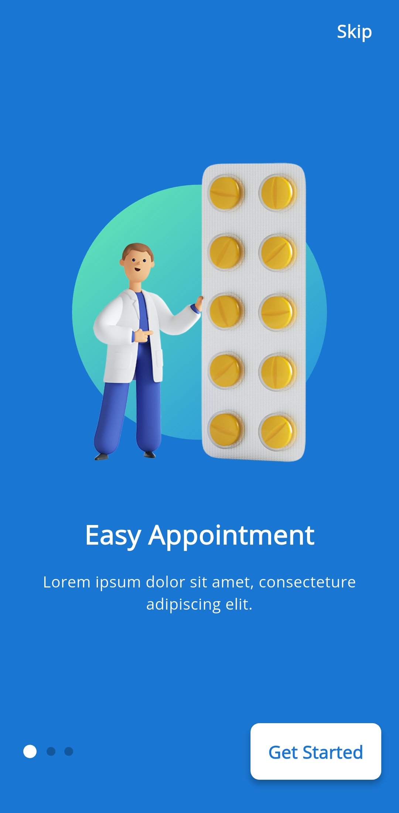</td>
    <td></td>
    <td>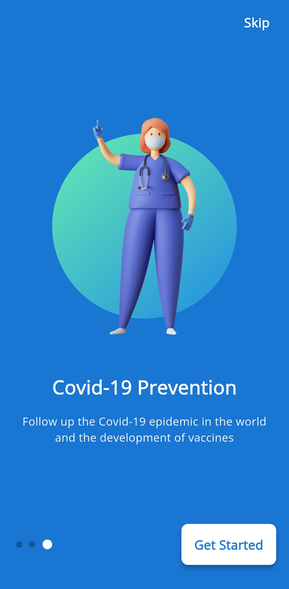</td>
  </tr>
  <tr>
    <td>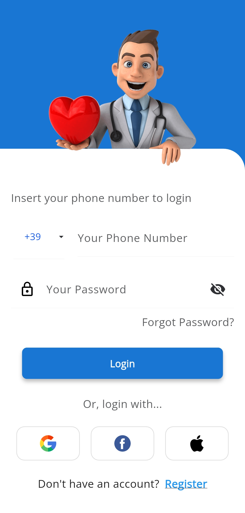</td>
    <td>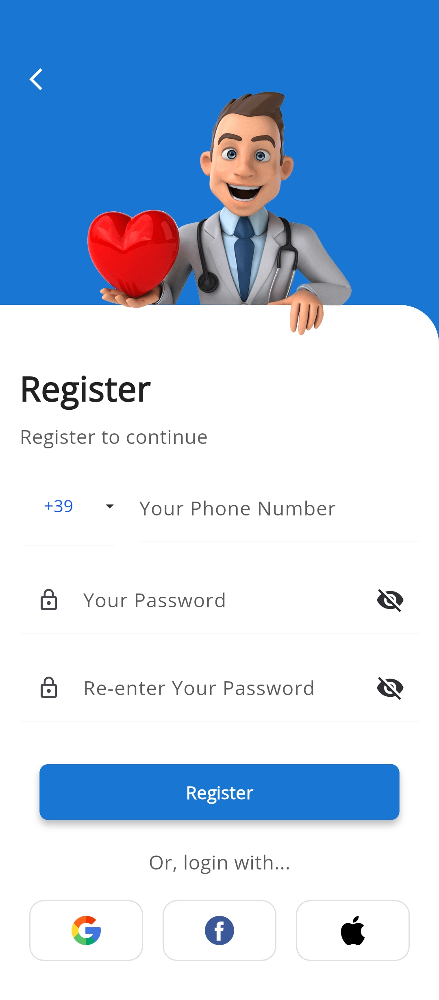</td>
    <td>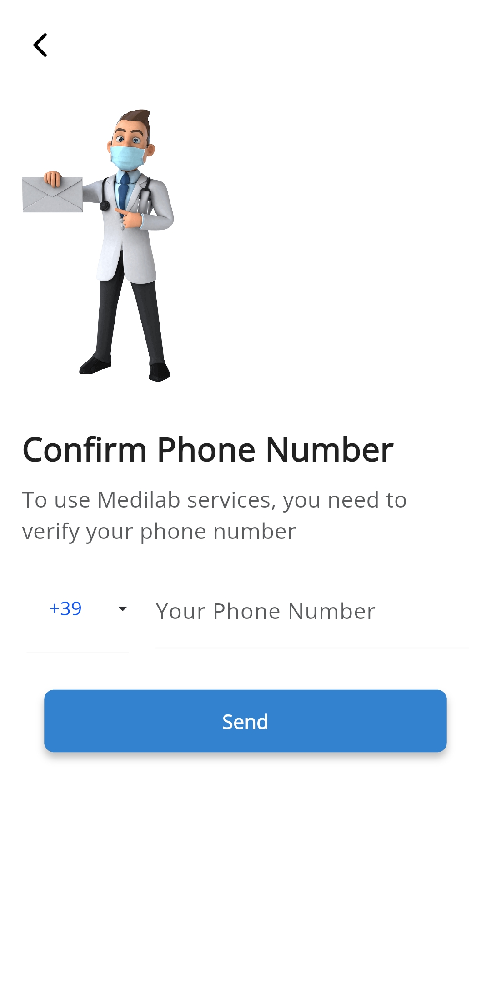</td>
    <td>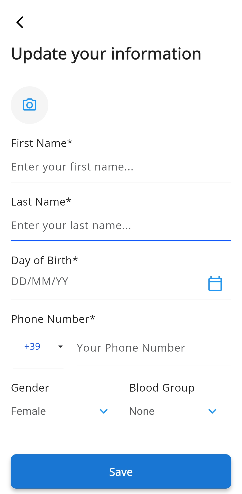</td>
  </tr>
  <tr>
    <td></td>
    <td>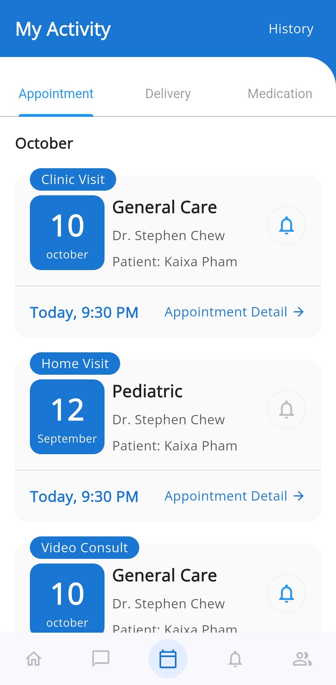</td>
    <td>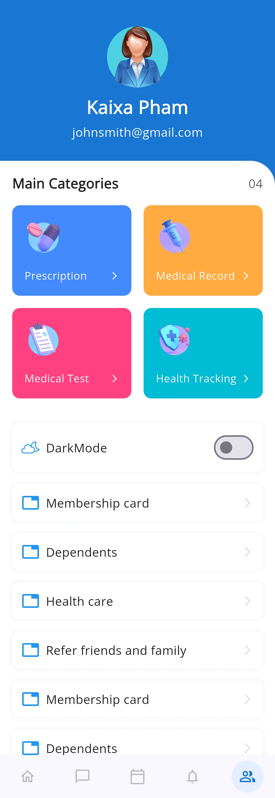</td>
    <td>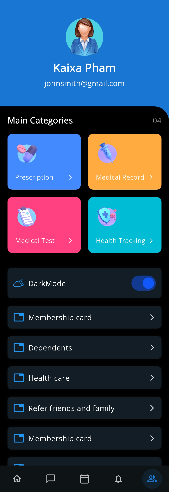</td>
  </tr>
  <tr>
    <td>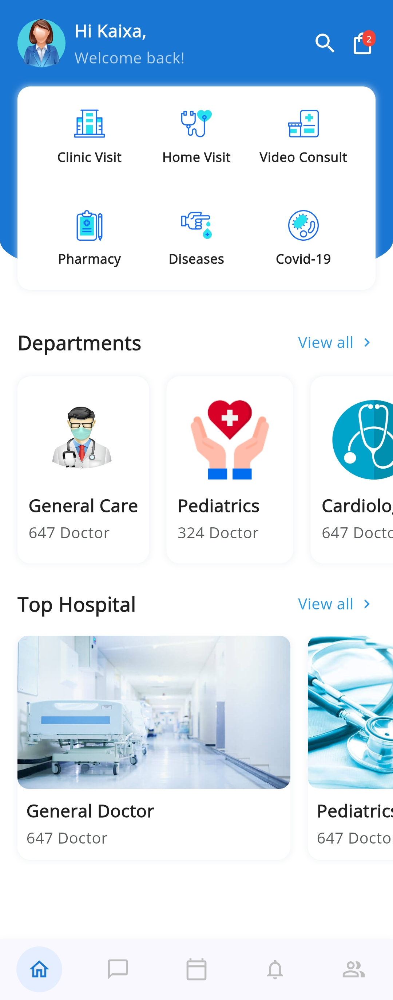</td>
    <td>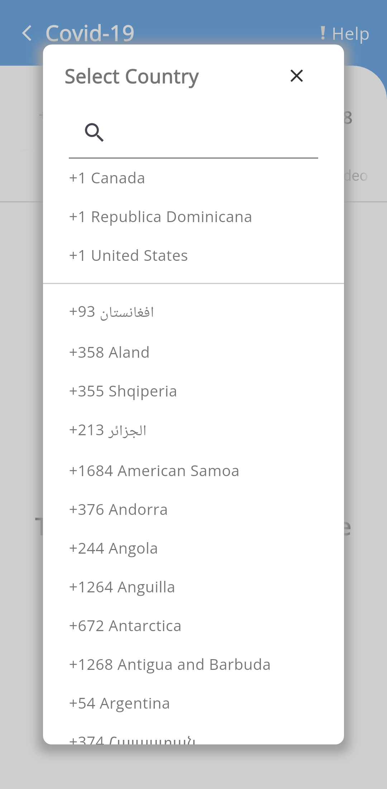</td>
    <td>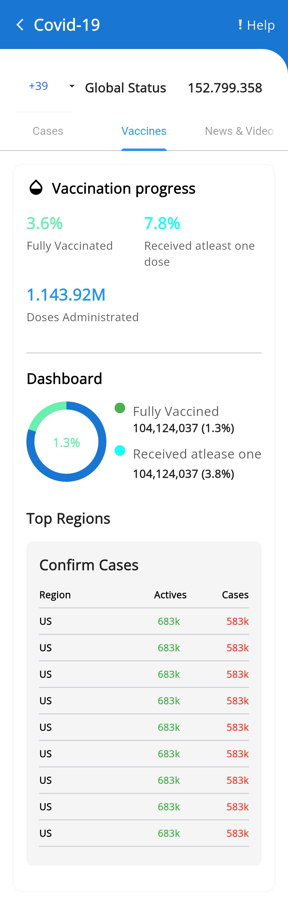</td>
    <td>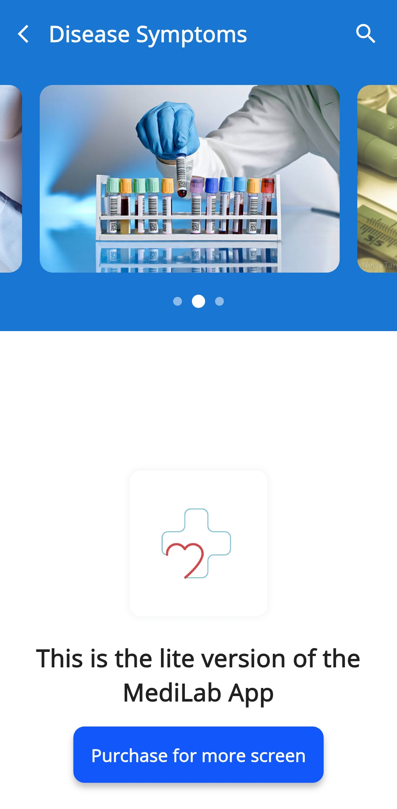</td>
  </tr>
  <tr>
    <td>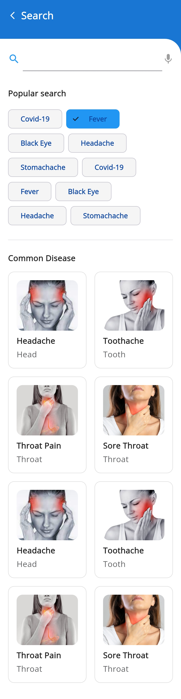</td>
    <td>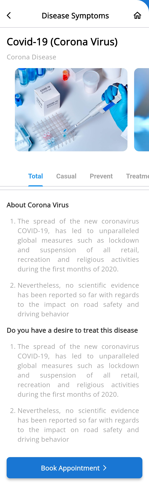</td>
    <td>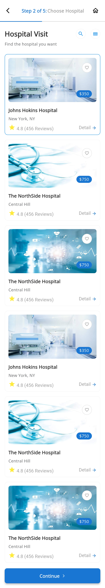</td>
    <td>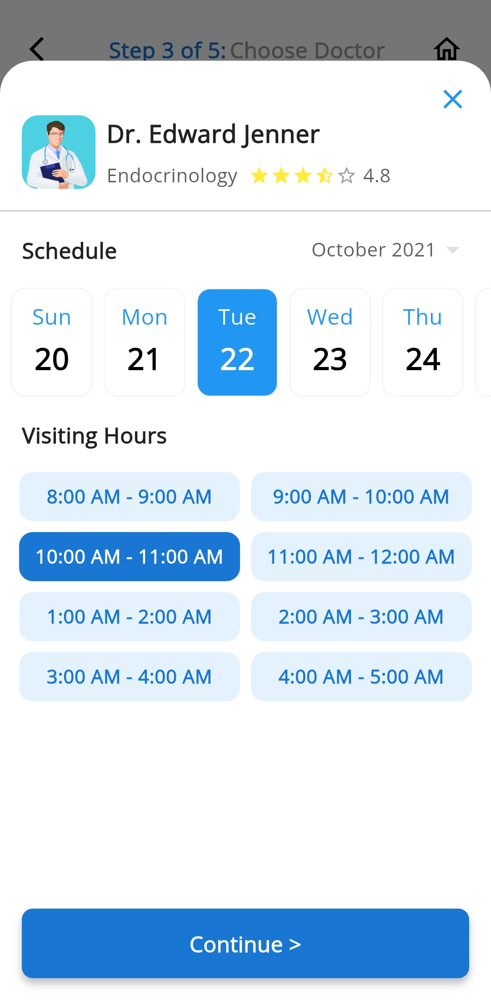</td>
  </tr>
  <tr>
    <td>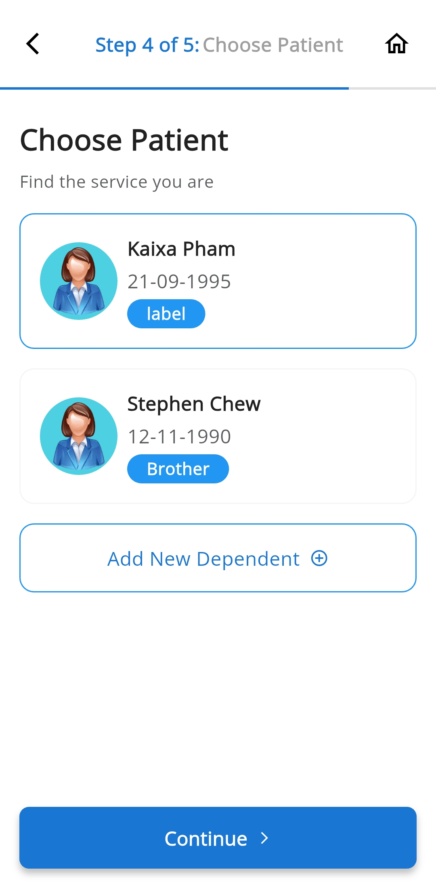</td>
    <td>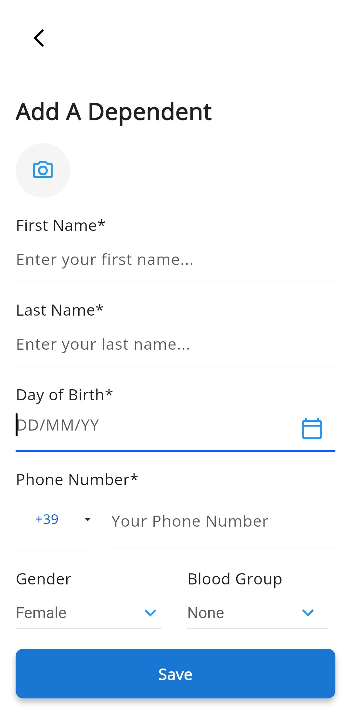</td>
    <td>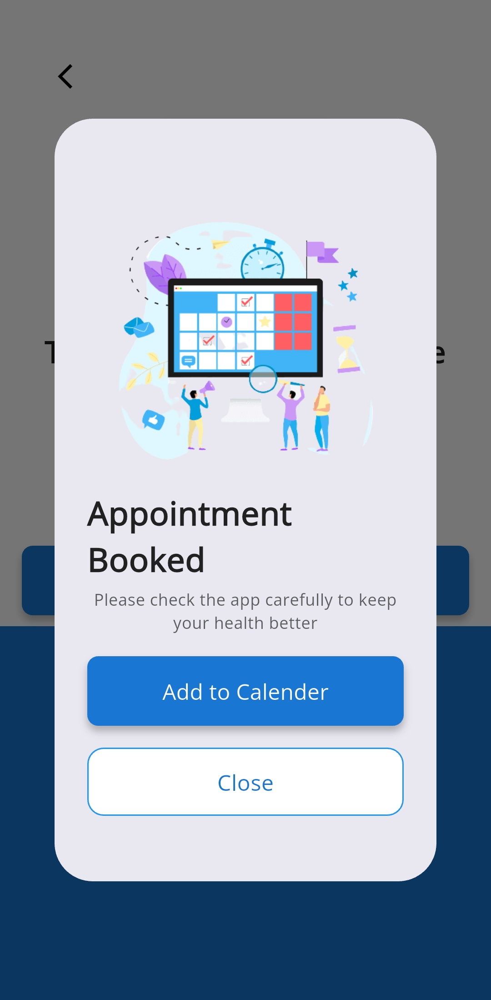</td>
    <td>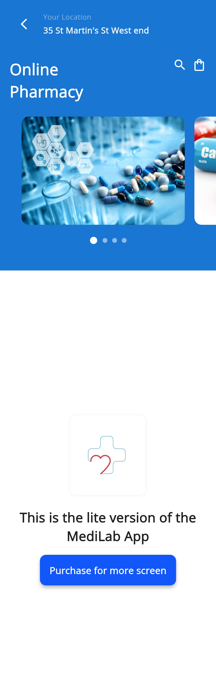</td>
  </tr>
  <tr>
    <td></td>
    <td></td>
    <td>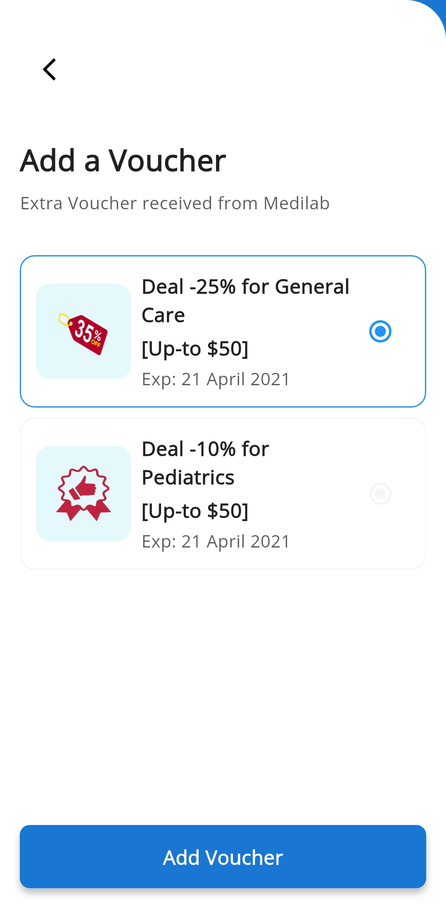</td>
    <td></td>
  </tr>
</table>

---

## 📝 Notes

- Built entirely with Flutter
- Rich in UI components tailored for healthcare
- Perfect base for hospital, clinic, or health service apps

---

## ✍️ Created by

**Mohamed Ebrahim**
